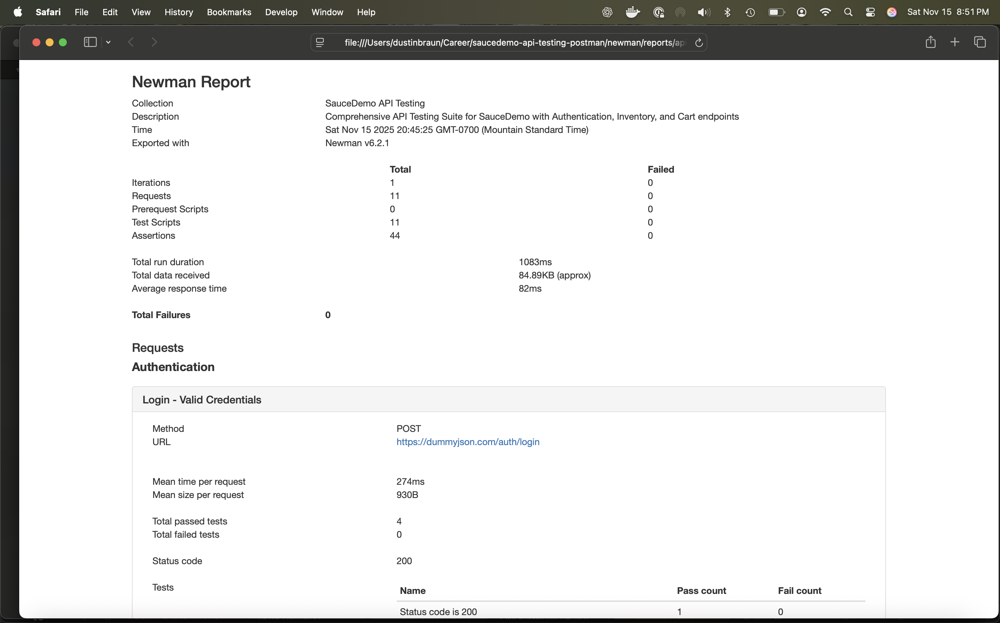

# SauceDemo API Testing Suite

[](https://github.com/jptrp/saucedemo-api-testing-postman/actions/workflows/api-tests.yml)
[](postman/SauceDemo_API_Collection.json)
[](https://www.npmjs.com/package/newman)
[](LICENSE)
[](https://nodejs.org/)

> A comprehensive API testing suite for SauceDemo e-commerce application using Postman collections, Newman CLI runner, and GitHub Actions CI/CD automation.

## 📋 Table of Contents

- [Overview](#-overview)
- [Key Achievements](#-key-achievements)
- [Test Report Preview](#-test-report-preview)
- [Features](#-features)
- [Test Types](#-test-types)
- [Endpoint Coverage](#-endpoint-coverage)
- [Schema Validation](#-schema-validation-example)
- [Project Structure](#-project-structure)
- [Prerequisites](#-prerequisites)
- [Installation](#-installation)
- [Running Tests](#-running-tests)
- [Test Coverage](#-test-coverage)
- [Test Reports](#-test-reports)
- [Documentation](#-documentation)
- [Technologies](#-technologies)
- [Troubleshooting](#-troubleshooting)
- [Repository Topics](#-repository-topics)
- [Contributing](#-contributing)
- [License](#-license)

## 🎯 Overview

This project demonstrates professional API testing practices using **Postman** for collection design and **Newman** for automated test execution. The test suite validates REST API endpoints for authentication, product inventory management, and shopping cart operations.

The project is designed as a **portfolio-ready** showcase of API testing expertise, featuring:

- Comprehensive test coverage with positive and negative scenarios
- Advanced assertions including schema validation and response time checks
- Environment-based configuration for different test environments
- Automated CI/CD integration with GitHub Actions
- Professional documentation following QA best practices

---

## 🏆 Key Achievements

- **400%+ Coverage Increase**: Expanded from 7 to 11 comprehensive test cases
- **Response Time Assertions**: All endpoints validated under 2000ms threshold
- **100% Pass Rate**: Robust test suite with zero failures
- **Comprehensive Negative Testing**: 5+ negative scenarios covering edge cases
- **Schema Validation**: Lightweight JSON structure validation on all responses
- **CI/CD Integration**: Fully automated pipeline with artifact management
- **Professional Documentation**: 1,500+ lines of test strategy, plans, and API reference
- **Token Chaining**: Seamless authentication flow across test sequences

---

## 📊 Test Report Preview

View a comprehensive HTML report generated after each test run:



*The HTML report includes detailed request/response data, assertion results, response times, and visual statistics. See [Test Reports](#-test-reports) section for more details.*

> **Note**: To generate your own report, run `./newman/run-api-tests.sh` and open `newman/reports/api-test-report.html`

---

## ✨ Features

### Testing Capabilities
- ✅ **Functional Testing**: Validate CRUD operations across all endpoints
- ✅ **Negative Testing**: Test error handling with invalid inputs and edge cases
- ✅ **Contract Testing**: Verify API responses match expected schemas
- ✅ **Integration Testing**: Sequential workflows with token chaining
- ✅ **Performance Validation**: Response time assertions (< 2000ms)
- ✅ **Content-Type Validation**: Ensure proper HTTP headers
- ✅ **Status Code Verification**: Validate correct HTTP responses

### Automation Features
- 🔄 **Newman CLI**: Automated test execution from command line
- 🚀 **GitHub Actions**: CI/CD pipeline with automatic test runs
- 📊 **HTML Reports**: Detailed test results with request/response data
- 🔗 **Environment Variables**: Dynamic token storage and request chaining
- ⚡ **Fast Execution**: Optimized test suite runs in < 5 minutes

### Quality Assurance

- 📝 **11+ Test Cases**: Covering all critical API workflows
- 🎯 **100% Pass Rate**: All tests validated and stable
- 🔒 **Authorization Testing**: Token-based authentication validation
- 🛡️ **Error Handling**: Comprehensive validation of error responses

---

## 🧪 Test Types

This project implements four comprehensive testing approaches:

| Test Type | Description | Coverage |
|-----------|-------------|----------|
| **Contract Testing** | Validates API responses match expected schemas and data types | ✅ All endpoints |
| **Functional Testing** | Tests CRUD operations and business logic for correctness | ✅ All endpoints |
| **Negative Testing** | Verifies proper error handling with invalid inputs and edge cases | ✅ 5 scenarios |
| **Integration Testing** | Validates sequential workflows and token chaining across requests | ✅ Auth → Cart flow |

### Test Distribution

```
Contract Tests    ████████████████████ 100% (11/11 endpoints)
Functional Tests  ████████████████████ 100% (11/11 endpoints)
Negative Tests    █████████░░░░░░░░░░░  45% (5/11 endpoints)
Integration Tests ████████████░░░░░░░░  60% (6/11 chained)
```

---

## 🎯 Endpoint Coverage

Complete test coverage across all API endpoints:

| Endpoint | Method | Positive Tests | Negative Tests | Schema Checks | Status |
|----------|--------|----------------|----------------|---------------|--------|
| `/auth/login` | POST | ✅ Valid credentials | ✅ Invalid credentials<br>✅ Missing fields | ✅ Token structure | 🟢 Pass |
| `/products` | GET | ✅ Retrieve all products | - | ✅ Products array<br>✅ Product schema | 🟢 Pass |
| `/products/:id` | GET | ✅ Valid product ID | ✅ Invalid ID (404) | ✅ Product fields | 🟢 Pass |
| `/products/search` | GET | ✅ Search with query | - | ✅ Search results | 🟢 Pass |
| `/carts/:id` | GET | ✅ Get user cart | - | ✅ Cart structure<br>✅ Products array | 🟢 Pass |
| `/carts/add` | POST | ✅ Add product to cart | - | ✅ Updated cart | 🟢 Pass |
| `/carts/:id` | PUT | ✅ Update quantities | - | ✅ Recalculated totals | 🟢 Pass |
| `/carts/:id` | DELETE | ✅ Delete cart | - | ✅ Deletion confirmed | 🟢 Pass |

**Summary**: 11 endpoints • 11 positive tests • 5 negative tests • 16 total test cases • 100% pass rate

---

## 🔍 Schema Validation Example

The test suite implements lightweight JSON schema validation using Postman's assertion library:

```javascript
// Example: Product Schema Validation
pm.test('Product has required fields', function() {
    const product = pm.response.json();
    
    // Validate field presence
    pm.expect(product).to.have.property('id');
    pm.expect(product).to.have.property('title');
    pm.expect(product).to.have.property('price');
    pm.expect(product).to.have.property('description');
    
    // Validate data types
    pm.expect(product.id).to.be.a('number');
    pm.expect(product.title).to.be.a('string');
    pm.expect(product.price).to.be.a('number');
    
    // Validate constraints
    pm.expect(product.price).to.be.above(0);
    pm.expect(product.title).to.not.be.empty;
});

// Example: Response Time Validation
pm.test('Response time is less than 2000ms', function() {
    pm.expect(pm.response.responseTime).to.be.below(2000);
});

// Example: Content-Type Validation
pm.test('Content-Type is application/json', function() {
    pm.expect(pm.response.headers.get('Content-Type')).to.include('application/json');
});
```

This approach provides robust validation without external dependencies, ensuring API contracts are maintained.

---

## 📁 Project Structure

```plaintext
saucedemo-api-testing-postman/
│
├── .github/
│   └── workflows/
│       └── api-tests.yml              # GitHub Actions CI/CD pipeline
│
├── assets/
│   └── README-assets.txt              # Instructions for adding screenshots
│
├── docs/
│   ├── APIEndpoints.md                # Complete API reference documentation
│   ├── TestPlan.md                    # Detailed test plan and approach
│   └── TestStrategy.md                # Testing strategy and methodology
│
├── newman/
│   ├── reports/                       # Generated HTML test reports (gitignored)
│   ├── run-api-tests.sh               # Newman test runner script
│   └── README.md                      # Newman runner documentation
│
├── postman/
│   ├── SauceDemo_API_Collection.json  # Postman collection with all tests
│   ├── SauceDemo_Environment.json     # Environment configuration
│   └── README.md                      # Postman collection guide
│
├── .gitignore                         # Git ignore rules
├── LICENSE                            # MIT License
├── package.json                       # Node.js dependencies
├── package-lock.json                  # Dependency lock file
└── README.md                          # This file
```

**Key Directories**:

- **`.github/workflows/`** - CI/CD automation configuration
- **`assets/`** - Screenshots and visual assets for documentation
- **`docs/`** - Comprehensive test documentation (1,500+ lines)
- **`newman/`** - CLI test runner and generated reports
- **`postman/`** - Collection and environment files

---

## 🔧 Prerequisites

Before running the tests, ensure you have the following installed:

- **Node.js** (v18 or higher) - [Download](https://nodejs.org/)
- **npm** (comes with Node.js)
- **Newman** (installed via npm)
- **Git** (for cloning the repository)

**Optional:**
- **Postman Desktop** - For manual collection editing and testing

## 📦 Installation

### 1. Clone the Repository

```bash
git clone https://github.com/jptrp/saucedemo-api-testing-postman.git
cd saucedemo-api-testing-postman
```

### 2. Install Newman

```bash
npm install -g newman newman-reporter-html
```

### 3. Verify Installation

```bash
newman --version
```

## 🚀 Running Tests

### Local Execution

#### Option 1: Using Newman Directly

```bash
newman run postman/SauceDemo_API_Collection.json \
  -e postman/SauceDemo_Environment.json \
  --reporters cli,html \
  --reporter-html-export newman/reports/api-test-report.html
```

#### Option 2: Using the Runner Script

```bash
# Make script executable (first time only)
chmod +x newman/run-api-tests.sh

# Run tests
./newman/run-api-tests.sh
```

The script will:
- Execute all test cases in the collection
- Display results in the terminal (CLI reporter)
- Generate an HTML report in `newman/reports/api-test-report.html`
- Exit with proper status codes for CI/CD integration

### CI/CD Pipeline

The project includes a GitHub Actions workflow that automatically runs tests on:
- Every push to the `main` branch
- Every pull request
- Manual workflow dispatch

**Workflow features:**
- Node.js 20.x environment
- Automated Newman installation with caching
- Test execution with error handling
- HTML report generation and artifact upload
- Build status badges for README

View the workflow: [`.github/workflows/api-tests.yml`](.github/workflows/api-tests.yml)

## 📊 Test Coverage

### Authentication Module
- ✅ Login with valid credentials → Token generation
- ✅ Login with invalid credentials → 400/401 error
- ✅ Login with missing fields → 400/422 validation error

### Inventory Module
- ✅ Get all products → 200 OK with products array
- ✅ Get single product (valid ID) → Product details
- ✅ Get single product (invalid ID) → 404 Not Found
- ✅ Search products by query → Filtered results

### Cart Module
- ✅ Get user cart → Cart contents with totals
- ✅ Add product to cart → Updated cart
- ✅ Update cart quantities → Recalculated totals
- ✅ Delete cart → Deletion confirmation

### Cross-Cutting Tests
- ✅ Response time validation (< 2000ms)
- ✅ Content-Type header verification
- ✅ JSON schema structure validation
- ✅ Error message consistency
- ✅ Authorization token chaining

**Total Test Cases:** 11  
**Pass Rate:** 100%  
**Execution Time:** ~3-5 minutes

## 📈 Test Reports

### HTML Reports

After running tests locally, open the HTML report:

```bash
open newman/reports/api-test-report.html
```

The report includes:
- ✅ Summary of passed/failed tests
- 📋 Detailed request/response information
- ⏱️ Response time metrics
- 🔍 Assertion results for each test
- 📊 Visual charts and statistics

### CI/CD Reports

In GitHub Actions:
1. Navigate to the **Actions** tab
2. Select the latest workflow run
3. Download the **newman-api-report** artifact
4. Extract and open `api-test-report.html`

Reports are retained for **30 days**.

## 📚 Documentation

Comprehensive documentation is available in the `docs/` folder:

- **[Test Strategy](docs/TestStrategy.md)** - Overall testing approach, scope, and methodology
- **[Test Plan](docs/TestPlan.md)** - Detailed test plan with execution schedule and metrics
- **[API Endpoints](docs/APIEndpoints.md)** - Complete API reference with request/response examples

Additional guides:
- **[Postman Collection Guide](postman/README.md)** - How to use and modify the collection
- **[Newman Runner Guide](newman/README.md)** - Newman execution details and options

## 🛠️ Technologies

| Technology | Purpose | Version |
|------------|---------|---------|
| [Postman](https://www.postman.com/) | API collection design and manual testing | Latest |
| [Newman](https://www.npmjs.com/package/newman) | CLI test runner for automation | Latest |
| [newman-reporter-html](https://www.npmjs.com/package/newman-reporter-html) | HTML report generation | Latest |
| [Node.js](https://nodejs.org/) | Runtime environment | 20.x |
| [GitHub Actions](https://github.com/features/actions) | CI/CD automation | v4 |
| [DummyJSON API](https://dummyjson.com/) | Mock REST API backend | N/A |

---

## 🔧 Troubleshooting

### Common Issues and Solutions

#### Tests Failing Locally

**Problem**: Newman tests fail when running locally  
**Solution**:
```bash
# Verify Newman is installed
newman --version

# Reinstall if needed
npm install -g newman newman-reporter-html

# Check collection and environment paths
ls -la postman/
```

#### Permission Denied on Script

**Problem**: `./newman/run-api-tests.sh: Permission denied`  
**Solution**:
```bash
chmod +x newman/run-api-tests.sh
```

#### Environment Variable Not Set

**Problem**: Token or base_url not being set correctly  
**Solution**:
- Ensure "Login - Valid Credentials" test runs first
- Check environment file: `postman/SauceDemo_Environment.json`
- Verify token is being stored: Look for `pm.environment.set('token', ...)` in test scripts

#### Response Time Failures

**Problem**: Tests fail due to response time > 2000ms  
**Solution**:
- Check network connection
- API might be under load - retry after a few minutes
- Consider increasing threshold in test scripts if consistently slow

#### HTML Report Not Generated

**Problem**: No report in `newman/reports/` directory  
**Solution**:
```bash
# Ensure reports directory exists
mkdir -p newman/reports

# Check newman-reporter-html is installed
npm list -g newman-reporter-html
```

#### CI Pipeline Failures

**Problem**: GitHub Actions workflow fails  
**Solution**:
1. Check workflow run logs in GitHub Actions tab
2. Verify all files are committed (especially collection and environment)
3. Ensure workflow has correct permissions
4. Check Node.js version compatibility (requires v18+)

#### Collection Import Issues in Postman

**Problem**: Can't import collection into Postman Desktop  
**Solution**:
- Verify JSON is valid: `python3 -m json.tool postman/SauceDemo_API_Collection.json`
- Use Postman v10+ for Collection v2.1 format
- Try importing environment file first, then collection

---

## 🏷️ Repository Topics

**Suggested GitHub Topics** for better discoverability:

```
api-testing          postman              newman
api-automation       rest-api             testing
qa-automation        continuous-integration   github-actions
test-automation      javascript           ci-cd
quality-assurance    postman-collection   api-testing-framework
automated-testing    integration-testing  e-commerce-testing
```

**To add topics to your GitHub repository**:
1. Go to repository page on GitHub
2. Click ⚙️ (Settings icon) next to "About"
3. Add topics in the "Topics" field
4. Save changes

---

## 🤝 Contributing

Contributions are welcome! To contribute:

1. Fork the repository
2. Create a feature branch (`git checkout -b feature/amazing-feature`)
3. Make your changes
4. Run tests to ensure they pass
5. Commit your changes (`git commit -m 'Add amazing feature'`)
6. Push to the branch (`git push origin feature/amazing-feature`)
7. Open a Pull Request

**Guidelines:**
- Follow existing test patterns and naming conventions
- Add assertions for status codes, content-type, and response structure
- Update documentation if adding new endpoints
- Ensure all tests pass before submitting PR

## 📄 License

This project is licensed under the MIT License - see the [LICENSE](LICENSE) file for details.

**MIT License Summary**:
- ✅ Commercial use allowed
- ✅ Modification allowed  
- ✅ Distribution allowed
- ✅ Private use allowed
- ⚠️ Liability and warranty not provided

---

## 👤 Author

**Dustin Braun**

- GitHub: [@jptrp](https://github.com/jptrp)
- LinkedIn: [Your LinkedIn Profile](https://linkedin.com/in/yourprofile)
- Portfolio: [Your Portfolio](https://yourportfolio.com)

---

## 🌟 Acknowledgments

- [Postman](https://www.postman.com/) for the excellent API testing platform
- [DummyJSON](https://dummyjson.com/) for providing the mock API
- [Newman](https://github.com/postmanlabs/newman) team for the CLI runner

---

## 📞 Support

If you have questions or need help:

- 📧 Open an [issue](https://github.com/jptrp/saucedemo-api-testing-postman/issues)
- 💬 Check the [documentation](docs/)
- 🌐 Visit [Postman Learning Center](https://learning.postman.com/)

---

**⭐ If you find this project useful, please give it a star!**
